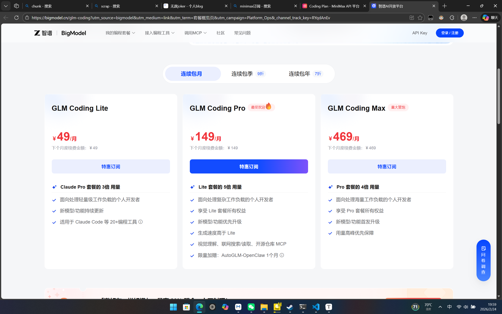
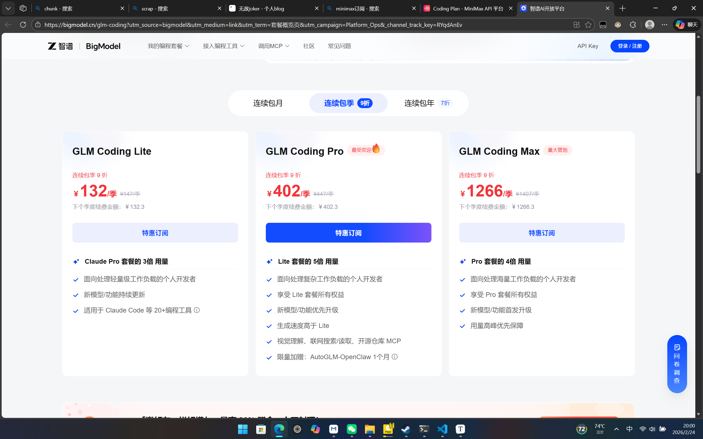
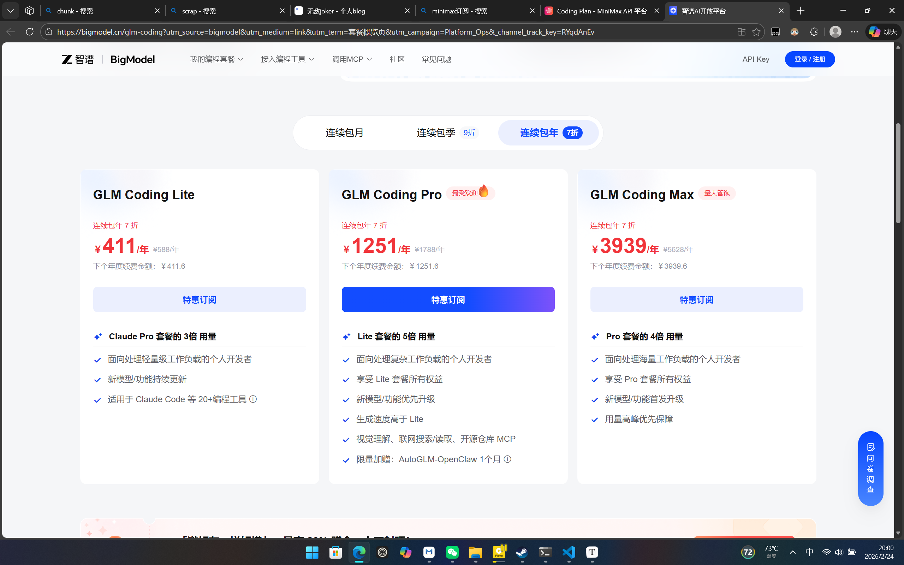
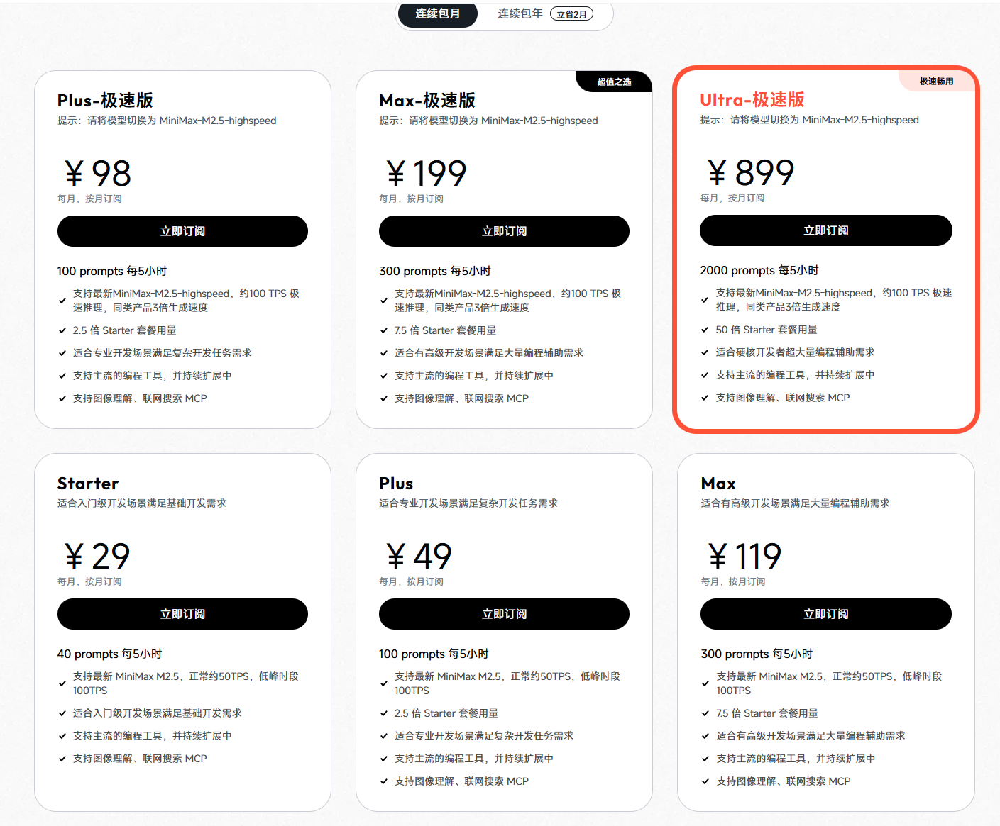
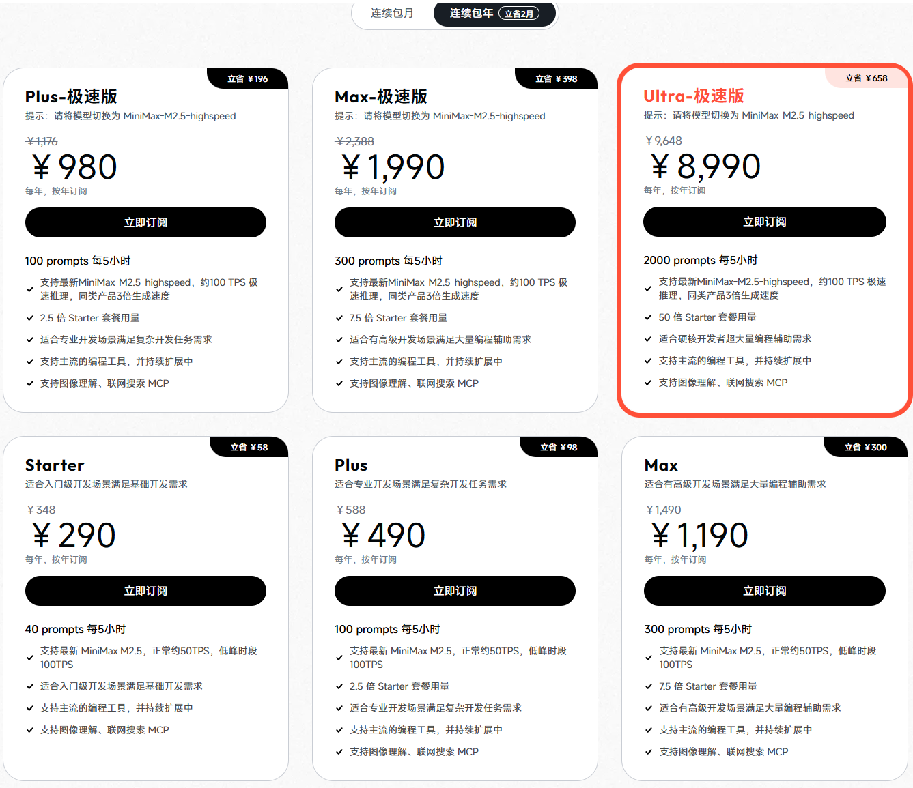
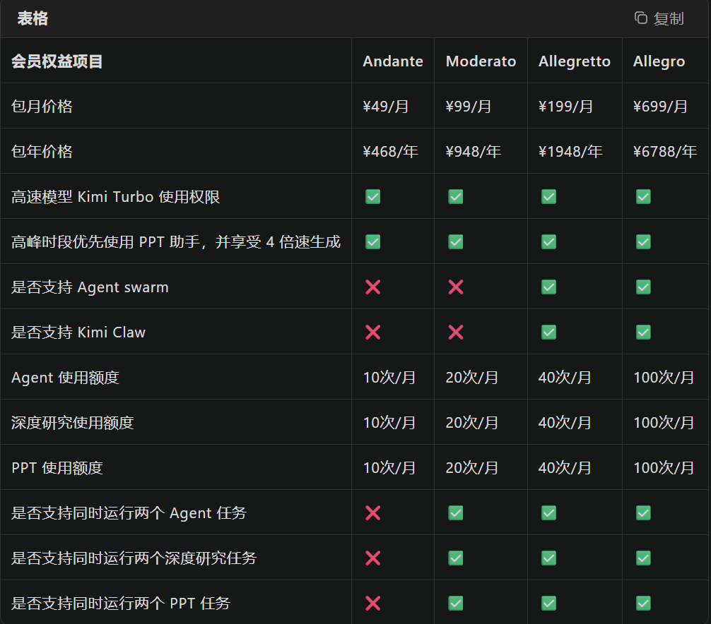
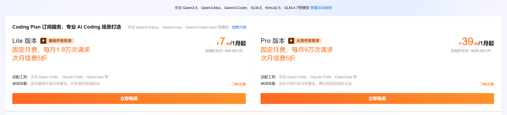

此贴仅用来记录2026年春节结束后的国内AI相关的订阅价格 `(≧▽≦)/`

当前国内各家的最新 coding 模型：

智谱发布的 GLM5，Minimax 推出 Minimax2.5，月之暗面的 Kimi2.5，以及一个 Qwen 3.5plus（在 coding 场景中似乎存在感偏低，连吐槽的人都不多 `🤔`）。

## 智谱

大幅度涨价，用量也收紧了。新的模型参数相当于 GLM4.7 的两倍，虽然能理解厂商在算力上遇到的挑战，但作为老用户还是有点被背刺的感觉 `QAQ`。

没有优惠的话，最低需要49，但是用量对up来说应该是够用的。`(╥╯﹏╰╥)ง`

## Minimax

Minimax 的订阅档位非常丰富，看得人有点头晕 `(@_@;)`。

最低挡位是29元，用量和Claude的pro账号差不多。

## Kimi

[Kimi AI 官网 - K2.5 上线](https://www.kimi.com/user/agreement/zh/membershipBenefits)

Kimi卖的策略似乎和其他家不一样，API价格正常按量计费，订阅的会员会解锁Chat端的新技能，但是对于会员账号得到的API，免费的额度看起来非常的少`(＃°Д°)`

卖的订阅感觉更像是主打Chat，coding的agent似乎只是赠品。

最低49元` (￣▽￣)~*`

## 阿里云

阿里云的coding plan中除了自家的qwen系列~刷分大王~，还提供了Kimi家的旗舰kimi2.5和GLM家的上代旗舰GLM4.7`(^o^)`

~为什么没有GLM5`＞﹏＜`，这不是逼着我用kimi2.5吗~

没有优惠的话是40元，用量还不少。`_〆(´Д｀ )`

> [!tip]
>
> 好像不能使用阿里云的学生优惠代金券，至少我没有首月订阅不允许我使用`_(:з)∠)_`

但是第三方部署之后的模型，不知道会不会和原厂的相比有差距 `(⊙﹏⊙)`

## 个人喜好

up只是一个穷学生，Minimax的29和阿里云的40对我来说很有吸引力。同时考虑到用量，我大概率最终会选择阿里云的coding plan，然后选择的kimi2.5做主力。在此之前，up的第一次玩AI订阅，贡献给了GLM的48首次包季的GLM4.7 `╰（‵□′）╯`