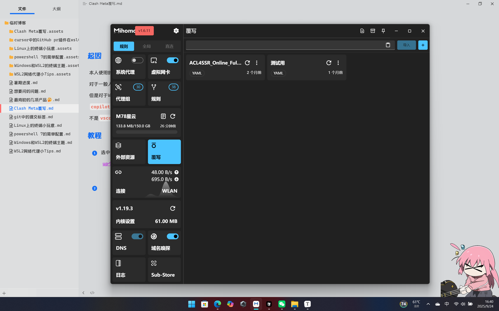
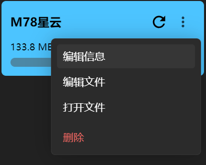
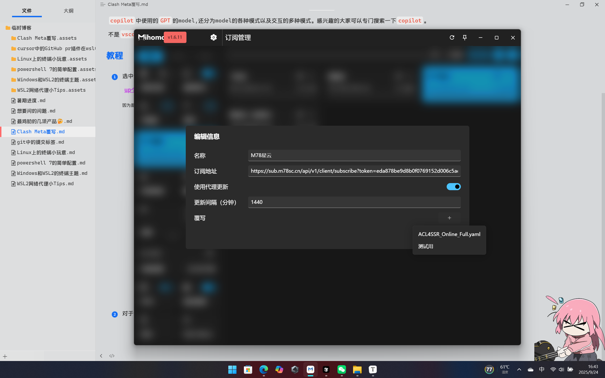

## 起因

本人使用的代理工具为`Clash Meta`。这个工具提供覆写功能（几乎所有的clash都支持覆写功能）。

对于一般人来说，绝大多数订阅提供商的规则已经是够用的了，但是对于我个人使用来看，似乎绝大多数代理提供商都没有为`Microsoft`走代理。🤔

但是对于Windows上的很多功能，有代理的情况下会更好用。up用的最多的就是`copilot`了( •̀ ω •́ )。

`copilot`中使用的`GPT`的model,还分为model的各种模式以及交互的多种模式。感兴趣的大家可以专门搜索一下`copilot`。

不是`vscode`中的`GitHub copilot`，而是系统级的`copilot`<(￣︶￣)↗[GO!]

## 教程

1. 选中侧边栏中的`覆写`选项卡，新建或者导入一个`yaml`格式文件。

   [up个人自用的文件](https://github.com/best-joker/clash-meta_override_files)

   ~因为是自己改的，所以可能会有点问题_(:з)∠)_~

   

2. 对于单个订阅添加覆写规则

   

   

3. 然后更新当前代理组

虽然能够有其他的AI客户端进行代替，并且`copilot`不再是当初那种深度集成系统，能够直接更改系统的AI助手，但是目前个人感觉，既然`Microsoft`为我们准备了这个“原生”的AI助手，体验一下也无伤大雅。§(*￣▽￣*)§

up最常用的就是`Alt + Space`组合键，将它置顶在最上方悬浮层。以及`Edge`中的`copilot`助手侧边栏。能够快速读取web内容😋。

