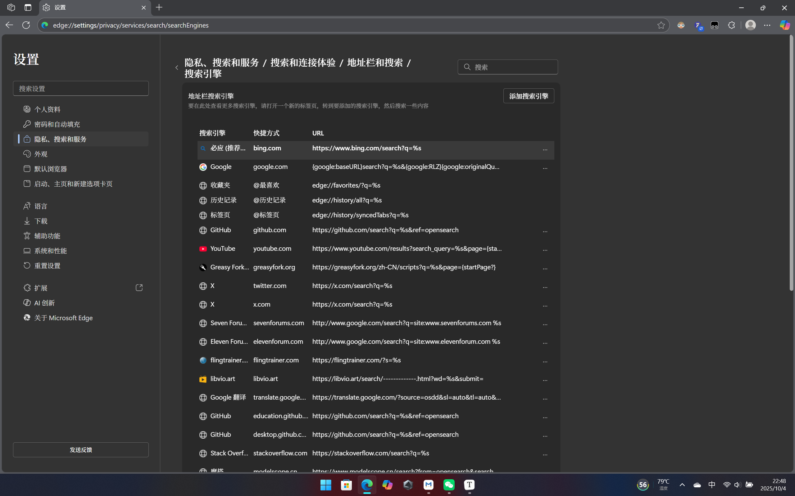

## 介绍 (´▽`ʃ♡ƪ)

现在的Edge默认使用的是国内版的搜索引擎 (｡•ˇ‸ˇ•｡)。  
即使是在有🪜的情况下，任然会重定向到cn版搜索引擎 (╯°□°）╯。

对于up主个人，edge的使用体验目前还行 (‾◡◝)。  
`copilot`、`垂直侧边栏`、`工作区`等功能也都有 (๑˃̵ᴗ˂̵)و。  
如果大家不想要迁移到chrome，同时也想要体验到edge的系统集成度，那么up可以提供一点方法 (づ｡◕‿‿◕｡)づ。

## 更换搜索引擎连接 (ง •̀_•́)ง

打开浏览器设置，点击`隐私、搜索和服务` -> `搜索和连接体验`  
点击 `地址栏和搜索` -> `搜索引擎` (o゜▽゜)o☆

<!-- و✧/搜索引擎设置.png) -->


对默认的bing的连接进行编辑 (๑•̀ㅂ•́)و✧。  
替换成：

```
https://www.bing.com/search?q=%s
```

现在这样操作之后，在🪜时，使用的就是海外版的bing (≧◡≦)。  
在没有魔法的时候，就会被重定向到CN的 (´･_･`)。

在使用CN版的Bing时，可以获得微软的奖励，去兑换KFC (๑´ڡ`๑)。  

我很喜欢吃😋 (⁄ ⁄•⁄ω⁄•⁄ ⁄)

## DeBug

现在发现，每一次重启Edge，都会恢复到CN版的Bing。搜索引擎的URL会被重置为默认的额CN版的Bing。

现在建议大家重新添加一个新的搜索引擎。然后将这个新的引擎设置为默认的引擎。