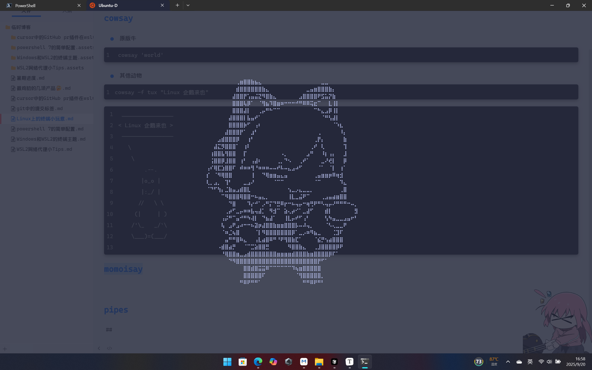
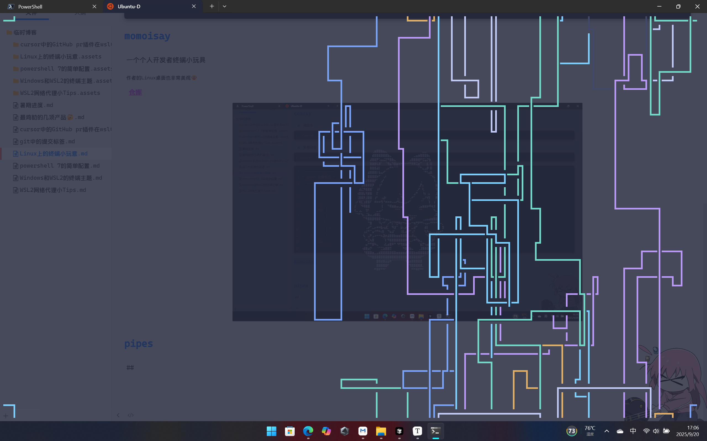
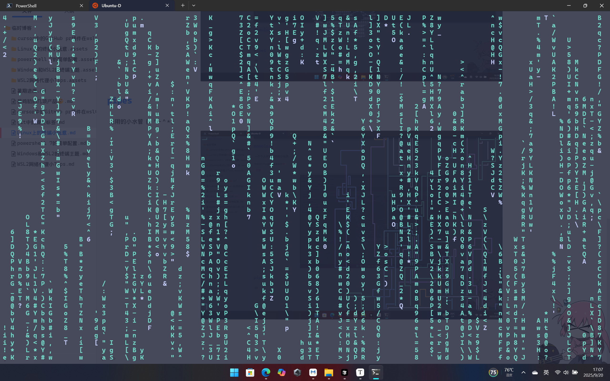

## cowsay

一个经典的终端小程序\~(￣▽￣)\~*

- 原版牛

```
 cowsay 'world'
```

- 其他动物

```
cowsay -f tux "Linux 企鹅来也"
```

```
 ________________
< Linux 企鹅来也 >
 ----------------
   \
    \
        .--.
       |o_o |
       |:_/ |
      //   \ \
     (|     | )
    /'\_   _/`\
    \___)=(___/

```

##  momoisay

一个个人开发者终端小玩具

~作者的Linux桌面也非常美观🤓~

[仓库](https://github.com/Mon4sm/momoisay.git)



## pipes

无用的小水管（\*＾-＾\*）



## cmatrix

模仿黑客帝国中的文字雨，有多个语言的版本。



## 结语

作为`Linux`初学者,我觉得这些非常的有意思( •̀ ω •́ )y,显得我是一个电脑高手。