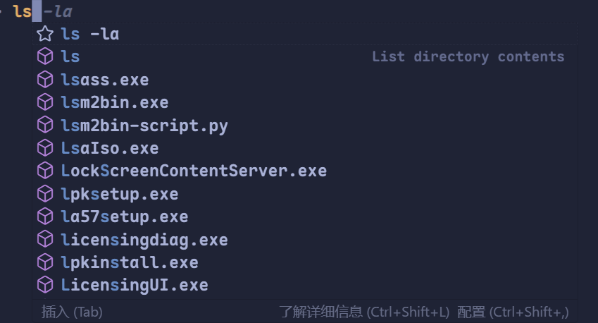

## 起因

`Windows`平台下的默认的终端是究极远古老祖`cmd`和`powershell 5`（以下简称`PS`）。后来本人在一次偶然的情况遇上了`PS 7`。

因为up主在`vscode`中使用copilot的时候，能够实现在输入部分不完整指令的情况下，能够出现指令的待选列表，就像是code时，`IDE`提供的`LSP`补全一样，非常好的好用(‾◡◝)



但是up在后来使用`cursor`的时候却发现，同样在启用`terminal.integrated.suggest.enabled`设置时，我的`cursor`却不能够正常开启该功能🥲

后来查阅资料发现，`cursor`对于这项功能的支持，只适用于`PS 7`（截至截稿时）。所以up通过`winget`包管理工具安装了`PS 7`。

```she
winget install --id Microsoft.PowerShell --source winget
```

在使用`PS 7`的时候发现`powershell`的预测性输入非常的好用，只需要按下`→`即可选中，同时不耽误原本的基础的`Tab`自动补全。\~(￣▽￣)\~*

## 脚本

通过改写`$PROFILE`文件实现自启动的一些功能。

```she
edit.exe $PROFILE
```

~这里的edit是一种终端编辑器，大家可以换成记事本或者其他编辑器~

```
# 设置控制台为 UTF-8 编码
$OutputEncoding = [console]::InputEncoding = [console]::OutputEncoding = New-Object System.Text.UTF8Encoding

# 注册 winget 参数补全
Register-ArgumentCompleter -Native -CommandName winget -ScriptBlock {
    param($wordToComplete, $commandAst, $cursorPosition)
    [Console]::InputEncoding = [Console]::OutputEncoding = $OutputEncoding = [System.Text.Utf8Encoding]::new()
    $Local:word = $wordToComplete.Replace('"', '""')
    $Local:ast = $commandAst.ToString().Replace('"', '""')
    winget complete --word="$Local:word" --commandline "$Local:ast" --position $cursorPosition | ForEach-Object {
        [System.Management.Automation.CompletionResult]::new($_, $_, 'ParameterValue', $_)
    }
}

# 启用git touch命令
function touch { param($name) New-Item -Path $name -ItemType File -Force }

# 启用git模块
#Import-Module posh-git

# 第一次使用git命令时加载
$script:PoshGitLoaded = $false
function git {
    if (-not (Get-Module posh-git)) {
        Import-Module posh-git -ErrorAction SilentlyContinue
        if (-not $script:PoshGitLoaded) {
            Write-Host "[posh-git 已启用]" -ForegroundColor Green
            $script:PoshGitLoaded = $true
        }
    }
    & git.exe @Args
}

function Enable-EnvProxy {
    $proxy = "http://127.0.0.1:7890"
    $env:http_proxy  = $proxy
    $env:https_proxy = $proxy
    Write-Host "环境变量代理已开启：$proxy"
}

function Disable-EnvProxy {
    Remove-Item Env:http_proxy  -ErrorAction SilentlyContinue
    Remove-Item Env:https_proxy -ErrorAction SilentlyContinue
    Write-Host "环境变量代理已关闭"
}

# 开机自启动代理
Enable-EnvProxy

# posh主题
oh-my-posh init pwsh --config "$env:POSH_THEMES_PATH\agnoster.minimal.omp.json" | Invoke-Expression
```


现在实现了一下功能：

- 终端自动设置的代理端口
- 使用`UTF-8`编码
- `winget`的`Tab`补全
- 按需启动`Git`模块（在第一次输入`git`指令的时候才开启）
- 方便的`touch`函数
- `oh-my-posh`的主题（已被注释）

希望能够帮到大家(*≧︶≦))(￣▽￣* )ゞ