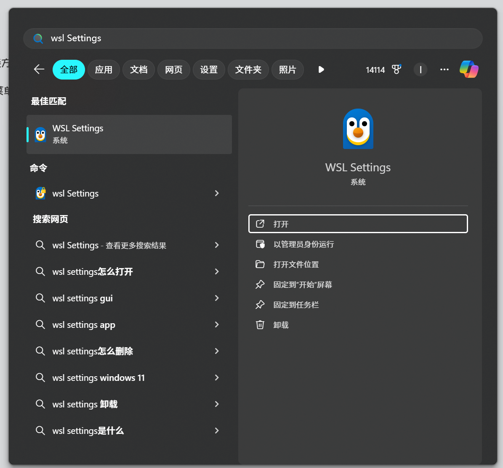

up在尝试使用使用WSL2的时候发现总是不能够使用Windows宿主机的网络代理，真的绕了好久(ノ｀Д)ノ

## 解决方法

更改WSL2的网络连接方式

1. Windows开始菜单搜索`WSL Setting`

   

2. 切换网络连接模式

   <!--  -->
   

   

虽然很简单，但是真的难倒了我\_(:з)∠)\_

**希望能够帮助到大家 (｡･∀･)ﾉﾞ**