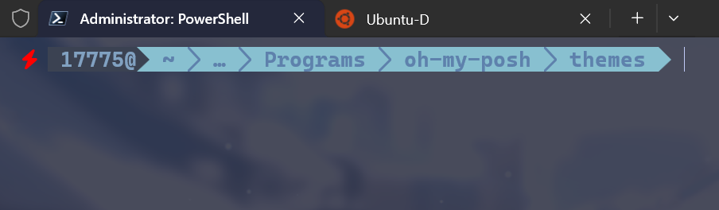
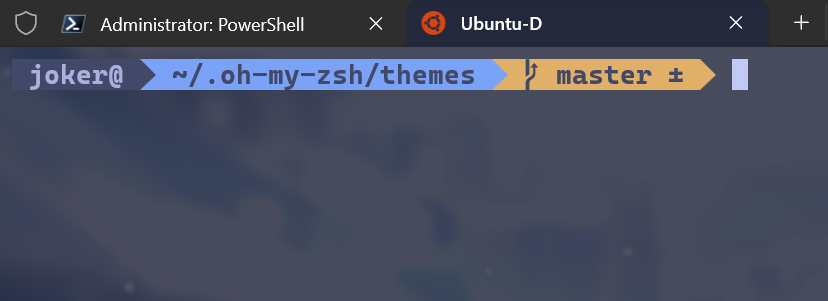

## 效果

up最近沉迷于终端不可自拔(‾◡◝) ，于是就想着折腾美化一下经常使用的终端

- Windows

  

- WSL2
  

## Windows

up使用的是`oh-my-posh`中的主题`agnoster.minimal.omp.json`文件的修改

键入指令

```shell
cd "$env:LOCALAPPDATA\Programs\oh-my-posh\themes"
```

即可在终端中进入`oh-my-posh`中的主题文件夹中。

我修改后的主题文件如下，主要修改了`prompt`的提示颜色，删除了显示机器的部分

```json
{
  "$schema": "https://raw.githubusercontent.com/JanDeDobbeleer/oh-my-posh/main/themes/schema.json",
  "blocks": [
    {
      "alignment": "left",
      "segments": [
        {
          "foreground": "#ffffff",
          "style": "plain",
          "template": "{{ reason .Code }}\u274c ",
          "type": "status"
        },
        {
          "foreground": "#ff0000",
          "style": "plain",
          "template": "",
          "type": "root"
        },
        {
          "background": "#3b4252",
          "foreground": "#81a1c1",
          "style": "plain",
          "template": " {{ .UserName }}@",
          "type": "session"
        },
        {
          "background": "#88c0d0",
          "foreground": "#5e81ac",
          "properties": {
            "folder_icon": "\u2026",
            "folder_separator_icon": " \ue0b1 ",
            "style": "agnoster_short",
            "max_depth": 3
          },
          "style": "plain",
          "template": "<#3b4252>\ue0b0</> {{ .Path }} ",
          "type": "path"
        },
        {
          "background": "#88c0d0",
          "foreground": "#5e81ac",
          "properties": {
            "cherry_pick_icon": "\u2713 ",
            "commit_icon": "\u25b7 ",
            "fetch_status": true,
            "merge_icon": "\u25f4 ",
            "no_commits_icon": "[no commits]",
            "rebase_icon": "\u2c62 ",
            "tag_icon": "\u25b6 "
          },
          "style": "plain",
          "template": "{{ .HEAD }}{{ if and (eq .Ahead 0) (eq .Behind 0) }} \u2261{{end}}{{ if gt .Ahead 0 }} \u2191{{.Ahead}}{{end}}{{ if gt .Behind 0 }} \u2193{{.Behind}}{{end}} {{ if .Working.Changed }}+{{ .Working.Added }} ~{{ .Working.Modified }} -{{ .Working.Deleted }} {{ end }}",
          "type": "git"
        },
        {
          "foreground": "#88c0d0",
          "style": "plain",
          "template": "\ue0b0 ",
          "type": "text"
        }
      ],
      "type": "prompt"
    }
  ],
  "version": 3
}

```

## WSL2

WSL2中，up安装的是Ubuntu和zsh、`oh-my-zsh`

只修改了一小部分。删除了显示用户名之后的显示机器名。文件路径最多最近的展示三级。

以下是修改的函数

```
prompt_context() {
  if [[ "$USERNAME" != "$DEFAULT_USER" || -n "$SSH_CLIENT" ]]; then
    # prompt_segment "$AGNOSTER_CONTEXT_BG" "$AGNOSTER_CONTEXT_FG" "%(!.%.)%n@%m"
    prompt_segment "$AGNOSTER_CONTEXT_BG" "$AGNOSTER_CONTEXT_FG" "%(!.%.)%n@"
  fi
}
```

```
# Dir: current working directory (max 3 levels)
prompt_dir() {
  if [[ $AGNOSTER_GIT_INLINE == 'true' ]] && $(git rev-parse --is-inside-work-tree >/dev/null 2>&1); then
    # Git repo and inline path enabled, hence only show the git root
    prompt_segment "$AGNOSTER_DIR_BG" "$AGNOSTER_DIR_FG" "$(git_toplevel | sed "s:^$HOME:~:")"
  else
    # Get current path, replace $HOME with ~
    local current_path=${PWD/#$HOME/\~}
    # Split path into array
    local path_parts=("${(s:/:)current_path}")
    local path_length=${#path_parts}
    
    if (( path_length > 3 )); then
      # If more than 3 levels, show .../last_three_dirs
      prompt_segment "$AGNOSTER_DIR_BG" "$AGNOSTER_DIR_FG" ".../${path_parts[-3]}/${path_parts[-2]}/${path_parts[-1]}"
    else
      # If 3 or fewer levels, show as is
      prompt_segment "$AGNOSTER_DIR_BG" "$AGNOSTER_DIR_FG" '%~'
    fi
  fi
}
```

一点点小小的美化 

**Ciallo～ (∠・ω< )⌒★**