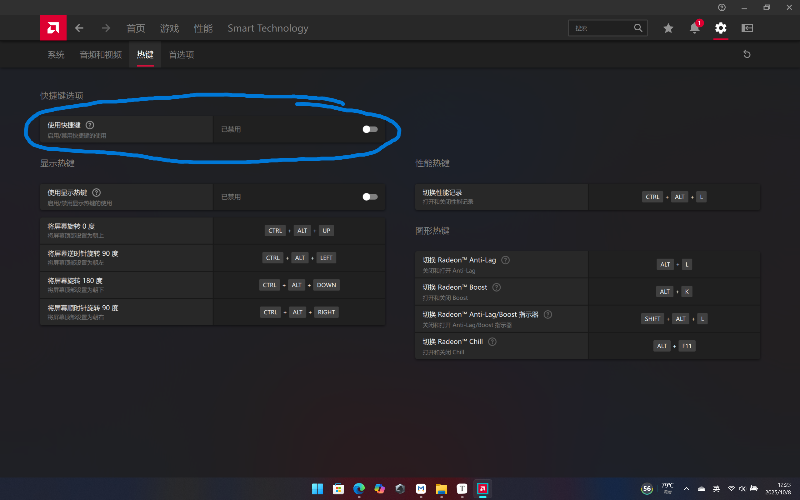

## 描述

`edge`浏览器的大部分的快捷键都是能够正常生效，但是当用户按下`CTRL + SHIFT + O`,即打开收藏夹的快捷键时。edge不会生效。

## 解决方法

出现这个情况的大概率的是`AMD`的机器。`AMD`的显卡管理部分的快捷键似乎会对`edge`产生影响。

~~虽然在查看之后，似乎没有快捷键是`CTRL + SHIFT + O`🤔~~

在关闭快捷键设置之后，能够使浏览器中的快捷键正常工作。

