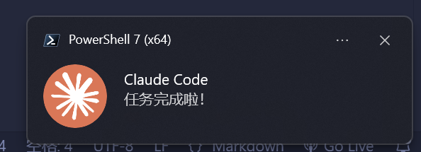

## 起因

up最近开始使用`Claude code`了，但是发现，`Claude code`不会有像`cursor`那样的系统提示，即在需要开发者手动确认或者工作完成时，不会像`cursor`那样会有系统级得提示。

但是现在的`Claude code`有`hooks`功能，可以实现类似的功能。



## 环境

up使用的是`Windows 11`和`WSL2`，`coding`环境在Linux中，所以，我对Claude code的提示配置，对于win和Linux用户应该都有一点帮助。`(￣▽￣*)`

### 弹窗

powershell有模块能够执行指令实现系统级的弹窗，所有我们需要先下载安装这个模块。

```
Install-Module -Name BurntToast -Scope CurrentUser -Force
```

安装完成之后尝试执行下面的命令，看看有没有成功。

```powershell
New-BurntToastNotification -Text "Claude Code", "任务完成啦！"
# tips
# 这里的"Claude Code"是弹窗的标题，"任务完成啦！"是弹窗的内容
# 你可以根据需要修改标题和内容
# 这里的"Claude Code"是弹窗的标题，"任务完成啦！"是弹窗的内容
# 可以加上 -AppLogo "D:\Edga下载\部分图像\Claude.png"之类的参数，来显示弹窗的图标
```

如果成功了，那么我们就可以开始配置`Claude code`的提示音啦！~~///(^v^)/\/\/\~~

### 提示音

Linux中，我们可以使用`paplay`命令来播放提示音。

这些声音是Linux自带的（up使用的是Ubuntu），我觉得很好听`( •̀ ω •́ )✧`

```
paplay /usr/share/sounds/freedesktop/stereo/complete.oga

paplay /usr/share/sounds/freedesktop/stereo/dialog-warning.oga
```

如果成功了，那么我们就可以开始配置`Claude code`的提示音啦！~~///(^v^)/\/\/\~~

### 配置

找到`.claude/settings.json`文件，添加以下内容：

```json
{
  "env": {
    "ANTHROPIC_DEFAULT_HAIKU_MODEL": "glm-4.5-air",
    "ANTHROPIC_DEFAULT_SONNET_MODEL": "glm-4.6",
    "ANTHROPIC_DEFAULT_OPUS_MODEL": "glm-4.6"
  },
  "hooks": {
    "Stop": [
      {
        "matcher": "",
        "hooks": [
          {
            "type": "command",
            "command":"pwsh.exe -NoProfile -Command \"New-BurntToastNotification -Text 'Claude Code','任务完成啦！' -AppLogo 'D:\\Edga下载\\部分图像\\Claude.png'\" && paplay /usr/share/sounds/freedesktop/stereo/complete.oga"
          }
        ]
      }
    ],
    "Notification": [
      {
        "matcher": "",
        "hooks": [
          {
            "type": "command",
            "command":"pwsh.exe -NoProfile -Command \"New-BurntToastNotification -Text 'Claude Code','需要确认哦！' -AppLogo 'D:\\Edga下载\\部分图像\\Claude.png'\" && paplay /usr/share/sounds/freedesktop/stereo/dialog-warning.oga"
          }
        ]
      }
    ]
  },
  "alwaysThinkingEnabled": false
}
```

## 总结

现在你的Claude code就能够实现在需要你手动确认和工作结束的时候弹出弹窗和声音咯`\(￣︶￣*\))`

另外要注意是，在json文件中，注意正反斜杠的转义，我因为这个吃了亏`╯︿╰`